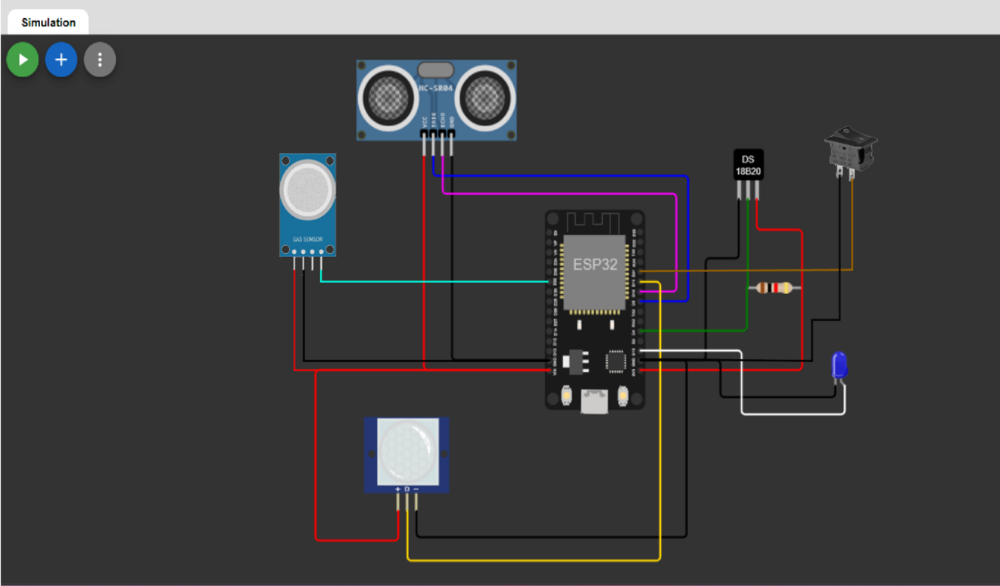

# ESP32 Sensor Monitoring System

## Description
This project is a comprehensive **sensor monitoring system** using **ESP32**, written in **Arduino C++** and **PHP**. It supports two Wi-Fi modes: **Station** and **Access Point (AP)**. Sensor data is dynamically stored, monitored, and managed both locally on the ESP32 and remotely on a web server with database integration.

In **AP mode**, data is stored locally on **SPIFFS**. Each sensor has its own file, and when the file is full, a dynamic cursor replaces old data with new entries.  

In **Station mode**, sensor data is sent to a remote server and stored in a database. Users can also request sensor data via **SMS**, and receive alerts if sensor values exceed predefined thresholds.  

The web interface allows users to:
- Monitor live sensor values
- Filter data by sensor type
- Download data as Excel files
- Check sensor connectivity status  

Data stored on SPIFFS is automatically uploaded to the server once an internet connection is available.

## Hardware Setup
The diagram below shows how to connect all sensors to the ESP32:



## Web Interface
Screenshot of the real-time sensor monitoring dashboard:


## Features
- Dual Wi-Fi operation: **Station** or **Access Point**
- Local storage on **ESP32 SPIFFS**
- Automatic circular storage when files are full
- Sensor types supported: **Temperature (DS18B20)**, **Distance (HC-SR04)**, **Air Quality (MQ-135)**, **PIR Motion**
- Real-time monitoring on web interface
- Download sensor data as **Excel files**
- SMS-based data retrieval
- SMS alerts for threshold violations
- Automatic syncing of local data to server when online
- Written in **Arduino C++** and **PHP**

## Hardware Requirements
- ESP32 Development Board
- DS18B20 Temperature Sensor
- HC-SR04 Ultrasonic Sensor
- MQ-135 Air Quality Sensor
- PIR Motion Sensor
- SIM800 GSM Module (for SMS)
- LEDs for status indication

## Software Requirements
- Arduino IDE
- ESP32 board support
- SPIFFS file system support
- Web server with PHP and database (MySQL recommended)

## Installation
1. Clone the repository:
   ```bash
   git clone https://github.com/sahandfakoori/esp32-sensor-monitoring.git
